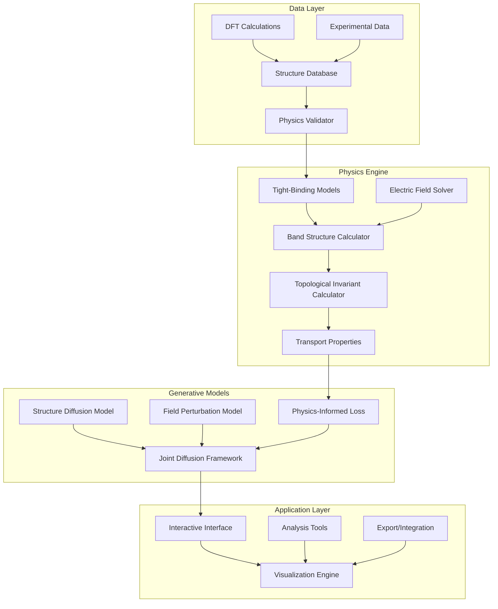

# Design Document

## Overview

The Topological Diffusion Generator is a sophisticated computational framework that combines state-of-the-art physics theory with advanced generative machine learning to model and predict topological insulators under perturbed electric fields. The system integrates multiple physics scales from atomic tight-binding models to mesoscopic transport phenomena, using physics-informed diffusion models to generate novel topological materials while preserving fundamental physical constraints.

The architecture builds upon existing ComFormer and transformer-based approaches in the codebase, extending them with topological physics constraints and electric field perturbation modeling. The system enables researchers to explore the rich phase space of topological materials and understand the transition mechanisms between insulating and conducting states.

## Architecture

### High-Level System Architecture



### Core Components Architecture

The system consists of four main architectural layers:

1. **Physics Foundation Layer**: Handles fundamental physics calculations including tight-binding Hamiltonians, band structure computations, and topological invariant calculations
2. **Generative Model Layer**: Implements physics-informed diffusion models for structure and field generation
3. **Integration Layer**: Manages multi-scale physics integration and constraint enforcement
4. **Interface Layer**: Provides research tools, visualization, and analysis capabilities

## Components and Interfaces

### 1. Physics Foundation Components

#### TopologicalHamiltonian
```python
class TopologicalHamiltonian:
    """Manages tight-binding Hamiltonians with spin-orbit coupling"""
    def __init__(self, structure, soc_strength=0.1):
        self.structure = structure
        self.soc_strength = soc_strength
        self.hopping_matrix = None
        self.onsite_energies = None
    
    def build_hamiltonian(self) -> torch.Tensor
    def apply_electric_field(self, field_vector: torch.Tensor) -> torch.Tensor
    def compute_band_structure(self, k_points: torch.Tensor) -> Tuple[torch.Tensor, torch.Tensor]
    def get_surface_states(self) -> torch.Tensor
```

#### TopologicalInvariantCalculator
```python
class TopologicalInvariantCalculator:
    """Computes Z2 invariants, Chern numbers, and other topological quantities"""
    def compute_z2_invariant(self, hamiltonian: torch.Tensor) -> int
    def compute_chern_number(self, hamiltonian: torch.Tensor) -> int
    def compute_berry_curvature(self, eigenvectors: torch.Tensor) -> torch.Tensor
    def classify_topological_phase(self, invariants: Dict) -> str
```

#### ElectricFieldSolver
```python
class ElectricFieldSolver:
    """Handles electric field perturbations and self-consistent solutions"""
    def __init__(self, max_field_strength=1e6):  # V/m
        self.max_field_strength = max_field_strength
    
    def apply_uniform_field(self, structure: Structure, field: torch.Tensor) -> torch.Tensor
    def apply_gradient_field(self, structure: Structure, field_gradient: torch.Tensor) -> torch.Tensor
    def solve_self_consistent_field(self, structure: Structure, external_field: torch.Tensor) -> torch.Tensor
    def compute_critical_field(self, hamiltonian: torch.Tensor) -> float
```

### 2. Generative Model Components

#### PhysicsInformedDiffusion
```python
class PhysicsInformedDiffusion(JointDiffusion):
    """Extended diffusion model with physics constraints"""
    def __init__(self, lattice_diff, coord_sigmas, species_Q, physics_validator):
        super().__init__(lattice_diff, coord_sigmas, species_Q)
        self.physics_validator = physics_validator
        self.constraint_weight = 1.0
    
    def physics_informed_loss(self, model_output, targets, physics_constraints):
        """Combines standard diffusion loss with physics constraints"""
        standard_loss = super().loss(model_output, targets)
        physics_loss = self.compute_physics_loss(model_output, physics_constraints)
        return standard_loss + self.constraint_weight * physics_loss
    
    def compute_physics_loss(self, generated_structures, constraints):
        """Computes loss based on physical validity"""
        # Band gap constraints
        # Symmetry preservation
        # Topological invariant consistency
        # Current continuity
        pass
```

#### TopologicalTransformer
```python
class TopologicalTransformer(JointDiffusionTransformer):
    """Transformer architecture specialized for topological materials"""
    def __init__(self, num_species, conv_config, hidden_dim=256, num_topo_classes=4):
        super().__init__(num_species, conv_config, hidden_dim)
        
        # Additional heads for topological properties
        self.topo_invariant_head = nn.Linear(hidden_dim, num_topo_classes)
        self.band_gap_head = nn.Linear(hidden_dim, 1)
        self.conductivity_head = nn.Linear(hidden_dim, 3)  # σxx, σxy, σzz
        
        # Physics-aware attention mechanisms
        self.physics_attention = PhysicsAwareAttention(hidden_dim)
    
    def forward(self, Lt, Ft, At, edge_index, edge_attr, batch, t, field_vector=None):
        # Standard structure generation
        epsL_hat, scoreF_hat, logitsA = super().forward(Lt, Ft, At, edge_index, edge_attr, batch, t)
        
        # Additional physics predictions
        topo_class = self.topo_invariant_head(node_feats)
        band_gap = self.band_gap_head(node_feats)
        conductivity = self.conductivity_head(node_feats)
        
        return epsL_hat, scoreF_hat, logitsA, topo_class, band_gap, conductivity
```

#### PhysicsAwareAttention
```python
class PhysicsAwareAttention(nn.Module):
    """Attention mechanism that respects physical symmetries"""
    def __init__(self, hidden_dim, num_heads=8):
        super().__init__()
        self.hidden_dim = hidden_dim
        self.num_heads = num_heads
        
        # Symmetry-aware projections
        self.q_proj = EquivariantLinear(hidden_dim, hidden_dim)
        self.k_proj = EquivariantLinear(hidden_dim, hidden_dim)
        self.v_proj = EquivariantLinear(hidden_dim, hidden_dim)
        
        # Physics constraint embeddings
        self.symmetry_embedding = nn.Embedding(230, hidden_dim)  # Space groups
        self.field_embedding = nn.Linear(3, hidden_dim)  # Electric field vector
    
    def forward(self, x, symmetry_ops, field_vector=None):
        # Apply symmetry constraints to attention computation
        # Incorporate electric field effects
        pass
```

### 3. Integration Components

#### MultiScalePhysicsIntegrator
```python
class MultiScalePhysicsIntegrator:
    """Integrates physics across atomic to mesoscopic scales"""
    def __init__(self):
        self.atomic_solver = TightBindingSolver()
        self.mesoscopic_solver = EffectiveModelSolver()
        self.transport_solver = TransportSolver()
    
    def integrate_scales(self, structure, field_config):
        # Atomic scale: tight-binding Hamiltonian
        atomic_hamiltonian = self.atomic_solver.build_hamiltonian(structure)
        
        # Mesoscopic scale: effective low-energy theory
        effective_model = self.mesoscopic_solver.derive_effective_model(atomic_hamiltonian)
        
        # Transport scale: conductivity calculations
        transport_props = self.transport_solver.compute_transport(effective_model, field_config)
        
        return {
            'atomic': atomic_hamiltonian,
            'mesoscopic': effective_model,
            'transport': transport_props
        }
```

#### PhysicsValidator
```python
class PhysicsValidator:
    """Validates generated structures against physical constraints"""
    def __init__(self):
        self.symmetry_checker = SymmetryChecker()
        self.stability_checker = StabilityChecker()
        self.topology_checker = TopologyChecker()
    
    def validate_structure(self, structure, field_config=None):
        """Comprehensive physics validation"""
        results = {
            'is_valid': True,
            'violations': [],
            'confidence': 1.0
        }
        
        # Check crystal symmetries
        if not self.symmetry_checker.check_symmetries(structure):
            results['violations'].append('symmetry_violation')
            results['confidence'] *= 0.8
        
        # Check thermodynamic stability
        if not self.stability_checker.check_stability(structure):
            results['violations'].append('instability')
            results['confidence'] *= 0.6
        
        # Check topological consistency
        if not self.topology_checker.check_topology(structure, field_config):
            results['violations'].append('topology_inconsistency')
            results['confidence'] *= 0.7
        
        results['is_valid'] = len(results['violations']) == 0
        return results
```

### 4. Interface Components

#### TopologicalMaterialsExplorer
```python
class TopologicalMaterialsExplorer:
    """Interactive interface for exploring topological materials"""
    def __init__(self, model, physics_engine):
        self.model = model
        self.physics_engine = physics_engine
        self.visualization_engine = VisualizationEngine()
    
    def generate_materials(self, constraints):
        """Generate materials with specified constraints"""
        pass
    
    def analyze_material(self, structure, field_config):
        """Comprehensive analysis of a material"""
        pass
    
    def visualize_results(self, analysis_results):
        """Create interactive visualizations"""
        pass
```

## Data Models

### Core Data Structures

#### TopologicalMaterial
```python
@dataclass
class TopologicalMaterial:
    """Complete representation of a topological material"""
    structure: Structure  # Crystal structure
    hamiltonian: torch.Tensor  # Tight-binding Hamiltonian
    band_structure: BandStructure  # Electronic band structure
    topological_invariants: Dict[str, Union[int, float]]  # Z2, Chern numbers, etc.
    surface_states: Optional[torch.Tensor]  # Surface state dispersions
    field_response: Optional[FieldResponse]  # Response to electric fields
    transport_properties: Optional[TransportProperties]  # Conductivity tensors
    
    # Metadata
    material_id: str
    confidence_score: float
    generation_timestamp: datetime
    physics_validation: ValidationResult

@dataclass
class FieldResponse:
    """Electric field response properties"""
    critical_field: float  # Field strength for topological transition
    field_induced_gap: torch.Tensor  # Gap as function of field
    polarization: torch.Tensor  # Electric polarization
    current_density: torch.Tensor  # Current density distribution

@dataclass
class TransportProperties:
    """Transport and conductivity properties"""
    conductivity_tensor: torch.Tensor  # 3x3 conductivity tensor
    hall_conductivity: float  # Quantized Hall conductivity
    surface_conductance: float  # Surface state conductance
    bulk_resistivity: float  # Bulk resistivity
```

#### PhysicsConstraints
```python
@dataclass
class PhysicsConstraints:
    """Physics constraints for generation and validation"""
    # Symmetry constraints
    space_group: Optional[int]
    point_group: Optional[str]
    time_reversal_symmetry: bool
    inversion_symmetry: bool
    
    # Electronic constraints
    band_gap_range: Tuple[float, float]  # eV
    topological_class: Optional[str]  # 'TI', 'WSM', 'NI', etc.
    spin_orbit_coupling: bool
    
    # Field constraints
    max_field_strength: float  # V/m
    field_direction: Optional[torch.Tensor]
    preserve_topology_under_field: bool
    
    # Material constraints
    allowed_elements: Optional[List[str]]
    forbidden_elements: Optional[List[str]]
    max_atoms_per_cell: int
    stability_threshold: float
```

### Database Schema

#### MaterialsDatabase
```python
class MaterialsDatabase:
    """Database interface for storing and retrieving materials"""
    def __init__(self, db_path: str):
        self.db_path = db_path
        self.connection = self._initialize_db()
    
    def store_material(self, material: TopologicalMaterial):
        """Store a material with all its properties"""
        pass
    
    def query_materials(self, constraints: PhysicsConstraints) -> List[TopologicalMaterial]:
        """Query materials matching constraints"""
        pass
    
    def get_training_data(self, split_ratio: Tuple[float, float, float]) -> Tuple[DataLoader, DataLoader, DataLoader]:
        """Get train/val/test data loaders"""
        pass
```

## Error Handling

### Physics Error Handling

#### PhysicsException Hierarchy
```python
class PhysicsException(Exception):
    """Base exception for physics-related errors"""
    pass

class SymmetryViolationError(PhysicsException):
    """Raised when symmetry constraints are violated"""
    pass

class TopologicalInconsistencyError(PhysicsException):
    """Raised when topological invariants are inconsistent"""
    pass

class ConvergenceError(PhysicsException):
    """Raised when physics calculations fail to converge"""
    pass

class UnphysicalStateError(PhysicsException):
    """Raised when generated states are unphysical"""
    pass
```

#### Error Recovery Strategies
```python
class ErrorRecoveryManager:
    """Manages error recovery and fallback strategies"""
    def __init__(self):
        self.recovery_strategies = {
            SymmetryViolationError: self._recover_symmetry,
            TopologicalInconsistencyError: self._recover_topology,
            ConvergenceError: self._recover_convergence,
            UnphysicalStateError: self._reject_and_resample
        }
    
    def handle_error(self, error: PhysicsException, context: Dict):
        """Handle physics errors with appropriate recovery strategy"""
        strategy = self.recovery_strategies.get(type(error))
        if strategy:
            return strategy(error, context)
        else:
            raise error
```

### Model Error Handling

#### Generation Quality Control
```python
class GenerationQualityController:
    """Controls quality of generated materials"""
    def __init__(self, physics_validator: PhysicsValidator):
        self.validator = physics_validator
        self.rejection_threshold = 0.5
        self.max_attempts = 10
    
    def generate_with_quality_control(self, model, constraints):
        """Generate materials with quality control"""
        for attempt in range(self.max_attempts):
            try:
                material = model.generate(constraints)
                validation = self.validator.validate_structure(material.structure)
                
                if validation['confidence'] > self.rejection_threshold:
                    return material
                else:
                    continue
                    
            except PhysicsException as e:
                if attempt == self.max_attempts - 1:
                    raise e
                continue
        
        raise GenerationFailureError("Failed to generate valid material after maximum attempts")
```

## Testing Strategy

### Unit Testing Framework

#### Physics Module Tests
```python
class TestTopologicalInvariants(unittest.TestCase):
    """Test topological invariant calculations"""
    
    def setUp(self):
        self.calculator = TopologicalInvariantCalculator()
        self.test_structures = load_test_structures()
    
    def test_z2_invariant_calculation(self):
        """Test Z2 invariant calculation against known materials"""
        for structure, expected_z2 in self.test_structures['z2_materials']:
            hamiltonian = build_test_hamiltonian(structure)
            calculated_z2 = self.calculator.compute_z2_invariant(hamiltonian)
            self.assertEqual(calculated_z2, expected_z2)
    
    def test_chern_number_calculation(self):
        """Test Chern number calculation"""
        pass
    
    def test_berry_curvature_integration(self):
        """Test Berry curvature integration"""
        pass
```

#### Model Testing
```python
class TestTopologicalDiffusion(unittest.TestCase):
    """Test diffusion model functionality"""
    
    def test_physics_constraint_preservation(self):
        """Test that physics constraints are preserved during generation"""
        pass
    
    def test_symmetry_equivariance(self):
        """Test that model respects crystal symmetries"""
        pass
    
    def test_field_response_consistency(self):
        """Test consistency of field response predictions"""
        pass
```

### Integration Testing

#### End-to-End Physics Pipeline
```python
class TestPhysicsPipeline(unittest.TestCase):
    """Test complete physics calculation pipeline"""
    
    def test_structure_to_transport_pipeline(self):
        """Test full pipeline from structure to transport properties"""
        # Generate structure -> Build Hamiltonian -> Calculate bands -> 
        # Compute invariants -> Apply field -> Calculate transport
        pass
    
    def test_multiscale_consistency(self):
        """Test consistency across different physics scales"""
        pass
```

### Validation Against Experimental Data

#### Benchmark Testing
```python
class BenchmarkValidator:
    """Validates model predictions against experimental benchmarks"""
    
    def __init__(self):
        self.experimental_database = ExperimentalDatabase()
        self.tolerance_thresholds = {
            'band_gap': 0.1,  # eV
            'conductivity': 0.2,  # relative error
            'critical_field': 0.15  # relative error
        }
    
    def validate_predictions(self, predictions, material_ids):
        """Validate predictions against experimental data"""
        validation_results = {}
        
        for material_id in material_ids:
            experimental_data = self.experimental_database.get_data(material_id)
            predicted_data = predictions[material_id]
            
            validation_results[material_id] = self._compare_properties(
                experimental_data, predicted_data
            )
        
        return validation_results
```

### Performance Testing

#### Computational Performance
```python
class PerformanceProfiler:
    """Profile computational performance of physics calculations"""
    
    def profile_generation_speed(self, model, num_samples=100):
        """Profile material generation speed"""
        pass
    
    def profile_physics_calculations(self, structures):
        """Profile physics calculation performance"""
        pass
    
    def profile_memory_usage(self, batch_sizes):
        """Profile memory usage for different batch sizes"""
        pass
```

This comprehensive design provides a robust foundation for implementing the topological diffusion generator, ensuring both scientific accuracy and computational efficiency while maintaining extensibility for future research directions.